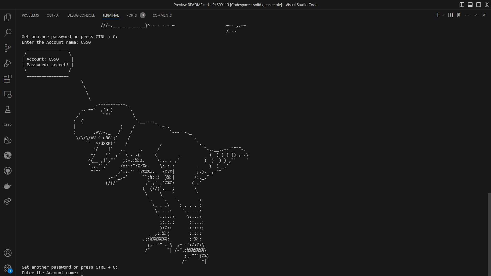

# Password Manager
## Video Demo:  <https://youtu.be/AOLUs2nGfCA>

### Description: This is a simple password manager made with Python and SQLITE3. It allows users to securely store and manage their passwords.
## Overview
The password manager is a secure application designed to store and manage user passwords. It provides a convenient and safe way to store passwords for various accounts, websites, and services. The manager encrypts the passwords to ensure their security, and only the user has access to decrypt and view them.
## Key Features
- **Master Password**: The password manager has a Master Password that is used to sign in to the program and it is hashed and used with a custom Salt to make encrypt and decrypt the passwords.
- **Custom Salt**: the user specify a salt that then will be used to generate a hash, with this hash the PM will generate the Key.
- **Hashing**: The Master password is hashed normally and stored in the data base.
- **Adding & Retrieving Passwords**:
    - **Encryption**: The passwords are encrypted using AES and stored in the database.
    - **Decrypiton**: When retrieving the passwords it's first decrypted by the same key and then dispalyed to the used.
- **Random Password Generation**: If the user didn't write a password the the when he is adding one then the PM will generate a random password for him.
- **Deleting**: You could delete passwords from the database if needed.
- **Tabulate**: the table of passwords is displayed using tabulate to make the experience more user friendly.
- **Cowsay**: The retrieved password will be displayed with a random cowsay shape just for fun and to make it more user friendly.
## How To Use
- **Register**: The first time you run the programe you will be asked to register.
- **Sign In**: After registering, when the program is ran again, it will ask you to sign in.
- **Commands**:
    - **--add**: If this command is entered, the user will be prompted to add a name and password in the data base.
    - **--get**: If this command is entered, the user will be prompted to enter the name of the password he want to get.
    - **--del**: If this command is entered, the user will be prompted to enter the name of the password he want to delete.
- **Exiting**: For example, if you are in the adding level and want to go back to enter another command then press **CTRL + C** to get to the upper level and so on.

